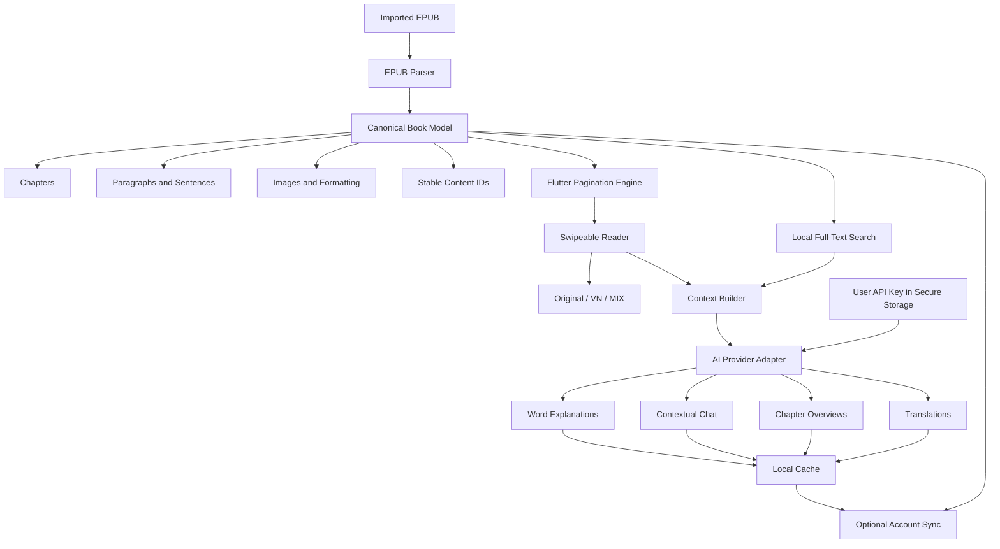

#  Product plan

## 1. Product objective

Build an Android reading application for imported EPUB books that presents content as a natural swipeable book and helps users understand difficult passages without leaving the reading screen.

The application will provide:

- Paginated left/right reading.
- Context-aware word and sentence explanations.
- Chapter overviews.
- Original, Vietnamese, and mixed-language modes.
- Offline reading.
- Optional synchronization.
- Bring-your-own-AI-key support.
- No mandatory account.

## 2. Confirmed product decisions

| Area | Decision |
|---|---|
| Initial platform | Android |
| Framework | Flutter |
| Initial content source | User-uploaded EPUB |
| Book marketplace | Not included |
| PDF support | Later |
| OCR | Later, for scanned PDFs and images |
| Reading direction | Paginated left/right swiping |
| Core reading | Offline |
| Initial AI | Online, using the user’s API key |
| Future AI | Offline where technically practical |
| Account | Not required for local reading |
| Synchronization | Required through an optional account |
| Translation layout | Reflowed content; no original PDF layout requirement |
| Chapter overview | Explains the chapter ahead so the reader sees the big picture |
| Source language | Detected from the uploaded book |
| Initial translation target | Vietnamese |

# 3. EARS requirements

EARS uses five primary patterns:

- **Ubiquitous:** The system shall…
- **Event-driven:** When…, the system shall…
- **State-driven:** While…, the system shall…
- **Unwanted behavior:** If…, then the system shall…
- **Optional feature:** Where…, the system shall…

## 3.1 Platform requirements

**PLAT-001 — Ubiquitous**  
The application shall be implemented in Flutter and released initially for Android.

**PLAT-002 — Ubiquitous**  
The application shall support Android phones in portrait and landscape orientations.

**PLAT-003 — State-driven**  
While the device is offline, the application shall allow the user to access imported books and all previously saved reading data.

**PLAT-004 — Unwanted behavior**  
If an online-only feature is requested without an internet connection, then the application shall explain that the feature requires connectivity and shall preserve the user’s current reading position.

## 3.2 EPUB import requirements

**BOOK-001 — Event-driven**  
When the user selects a valid EPUB file, the application shall import it into the local library.

**BOOK-002 — Event-driven**  
When an EPUB is imported, the application shall extract its metadata, cover, table of contents, chapters, paragraphs, sentences, images, and formatting.

**BOOK-003 — Event-driven**  
When an EPUB is imported, the application shall detect its primary language.

**BOOK-004 — Event-driven**  
When language detection is completed, the application shall allow the user to confirm or correct the detected language.

**BOOK-005 — Unwanted behavior**  
If an imported file is corrupted or unsupported, then the application shall reject the file without affecting existing books and shall present a readable explanation.

**BOOK-006 — Unwanted behavior**  
If an EPUB is protected by unsupported DRM, then the application shall inform the user that the book cannot be imported.

**BOOK-007 — Ubiquitous**  
The application shall retain the original EPUB file without modifying it.

**BOOK-008 — Ubiquitous**  
The application shall assign stable identifiers to chapters, paragraphs, sentences, and words.

Stable identifiers are important because visual page numbers change when the user changes font size, margins, or screen orientation.

## 3.3 Library requirements

**LIB-001 — Ubiquitous**  
The application shall allow users to read locally imported books without creating an account.

**LIB-002 — Event-driven**  
When the user opens the library, the application shall display each book’s cover, title, author, reading progress, and last-opened time.

**LIB-003 — Event-driven**  
When the user selects a book, the application shall open it at the most recently saved reading position.

**LIB-004 — Event-driven**  
When the user removes a book, the application shall request confirmation before deleting its local content.

**LIB-005 — Optional**  
Where the user chooses to remove a book, the application shall allow the user to decide whether associated notes, highlights, translations, and AI conversations are also removed.

**LIB-006 — Ubiquitous**  
The application shall provide library search and sorting.

## 3.4 Reading requirements

**READ-001 — Ubiquitous**  
The application shall present EPUB content as paginated pages.

**READ-002 — Event-driven**  
When the user swipes left, the application shall display the next page.

**READ-003 — Event-driven**  
When the user swipes right, the application shall display the previous page.

**READ-004 — Event-driven**  
When the user changes the font, font size, spacing, margins, theme, or orientation, the application shall repaginate the book while preserving the logical reading position.

**READ-005 — Ubiquitous**  
The application shall provide light, dark, and paper-like reading themes.

**READ-006 — Ubiquitous**  
The application shall provide access to the table of contents, bookmarks, highlights, notes, and in-book search.

**READ-007 — Event-driven**  
When the application moves to the background or closes, the application shall save the current reading position locally.

**READ-008 — Unwanted behavior**  
If pagination is recalculated, then the application shall continue to associate annotations and AI context with stable text identifiers rather than obsolete page numbers.

## 3.5 Word interaction requirements

**WORD-001 — Event-driven**  
When the user taps a word, the application shall select that word and display a compact contextual action menu.

**WORD-002 — Ubiquitous**  
The word action menu shall include Define, Ask AI, Translate, Highlight, and Copy.

**WORD-003 — Event-driven**  
When the user requests a contextual definition, the application shall provide the meaning that best fits the current sentence rather than presenting an unfiltered dictionary list.

**WORD-004 — Event-driven**  
When the user asks AI about a selected word, the application shall provide:

- Its contextual meaning.
- Its part of speech.
- Why it is used in that passage.
- A simpler paraphrase.
- At least two natural usage examples.

**WORD-005 — Unwanted behavior**  
If the word has multiple plausible contextual meanings, then the application shall explain the ambiguity instead of presenting one interpretation as certain.

## 3.6 Sentence and passage interaction requirements

**PASS-001 — Event-driven**  
When the user presses and holds text, the application shall allow selection of a sentence or longer passage.

**PASS-002 — Event-driven**  
When the selection is completed, the application shall display Explain, Ask AI, Translate, Summarize, Explain Grammar, Highlight, and Copy actions.

**PASS-003 — Event-driven**  
When the user selects Explain, the application shall explain the passage in simpler language while preserving its intended meaning.

**PASS-004 — Event-driven**  
When the user selects Explain Grammar, the application shall explain only the grammatical structures relevant to understanding the selected passage.

**PASS-005 — State-driven**  
While the AI response is being generated, the application shall keep the selected text visible and allow the user to continue reading or cancel the request.

## 3.7 Context-aware AI requirements

**AI-001 — Optional**  
Where the user enables AI features, the application shall require the user to configure a supported AI provider and API key.

**AI-002 — Event-driven**  
When the user saves an AI key, the application shall validate it before enabling AI actions.

**AI-003 — Ubiquitous**  
The application shall store the user’s AI key using Android’s protected credential storage.

**AI-004 — Ubiquitous**  
The application shall not include a developer-owned AI key in the distributed application.

**AI-005 — Event-driven**  
When the user asks a question from the reader, the application shall construct a context package containing:

- The selected text.
- The containing sentence and paragraph.
- Nearby paragraphs.
- The current chapter.
- The user’s reading position.
- Relevant earlier book passages.
- Recent messages from the current conversation.

**AI-006 — Ubiquitous**  
The application shall identify passages by stable content identifiers rather than visual page numbers.

**AI-007 — Event-driven**  
When the AI assistant makes an interpretation not explicitly stated by the author, the application shall label the response as an interpretation.

**AI-008 — Event-driven**  
When an AI response is generated successfully, the application shall cache it locally for later offline access.

**AI-009 — Unwanted behavior**  
If the configured provider rejects the API key, then the application shall disable new AI requests and guide the user to update the key without affecting reading features.

**AI-010 — Unwanted behavior**  
If an AI request fails, then the application shall offer Retry and shall not charge or count the request as successfully completed.

**AI-011 — Optional**  
Where multiple AI providers are supported, the application shall present a common provider-independent interface.

## 3.8 AI chatbot requirements

**CHAT-001 — Event-driven**  
When the user taps the assistant icon, the application shall open a chatbot without navigating away from the current book.

**CHAT-002 — Event-driven**  
When the chatbot opens, the application shall make the current book, chapter, reading position, and visible passage available as context.

**CHAT-003 — Event-driven**  
When the user moves to another part of the book while the chatbot remains open, the application shall update the active reading context.

**CHAT-004 — Ubiquitous**  
The chatbot shall allow the user to ask questions in natural language without manually copying book content.

**CHAT-005 — Event-driven**  
When a response relies on a specific part of the book, the application shall provide a link that returns the user to that passage.

**CHAT-006 — State-driven**  
While the user remains in the same conversation, the application shall retain relevant earlier questions and answers.

**CHAT-007 — Optional**  
Where the user chooses to save AI conversations, the application shall associate each conversation with its book.

## 3.9 Chapter overview requirements

**CHAP-001 — Event-driven**  
When the user reaches the beginning of a chapter, the application shall display a Chapter Overview action.

**CHAP-002 — Event-driven**  
When the user requests a chapter overview, the application shall analyze the complete chapter.

**CHAP-003 — Ubiquitous**  
The chapter overview shall include:

- The chapter’s big picture.
- Main ideas or events.
- Important concepts and terminology.
- The structure of the chapter.
- What the reader should pay attention to.

**CHAP-004 — Ubiquitous**  
The application shall clearly indicate that the chapter overview discusses content ahead in the chapter.

**CHAP-005 — Event-driven**  
When a chapter overview has already been generated, the application shall load the locally cached version unless the user explicitly regenerates it.

**CHAP-006 — Unwanted behavior**  
If chapter boundaries cannot be identified reliably, then the application shall ask the user to select the section to analyze.

## 3.10 Language and translation requirements

**LANG-001 — Event-driven**  
When a book is imported, the application shall record the detected source language in the book’s metadata.

**LANG-002 — Ubiquitous**  
The application shall initially support Vietnamese as the primary translation target.

**LANG-003 — Ubiquitous**  
The reader shall provide Original, VN, and MIX modes.

**LANG-004 — State-driven**  
While Original mode is active, the application shall display the source text without AI translation.

**LANG-005 — State-driven**  
While VN mode is active, the application shall display the Vietnamese translation in place of the source text.

**LANG-006 — State-driven**  
While MIX mode is active, the application shall display each original sentence followed by its Vietnamese translation.

**LANG-007 — Event-driven**  
When translating a passage, the application shall consider the surrounding paragraph, chapter context, book terminology, and established writing style.

**LANG-008 — Ubiquitous**  
The translation shall prioritize the author’s tone, voice, and intent rather than only producing a literal sentence-level translation.

**LANG-009 — Ubiquitous**  
The application shall maintain a per-book terminology glossary to improve translation consistency.

**LANG-010 — Event-driven**  
When a user switches reading modes, the application shall preserve the logical reading position.

**LANG-011 — Event-driven**  
When translated content is generated, the application shall cache it locally.

**LANG-012 — State-driven**  
While the device is offline, the application shall display previously cached translations.

**LANG-013 — Unwanted behavior**  
If a requested passage has not been translated and the device is offline, then the application shall display the original passage and explain that the translation is not yet available offline.

## 3.11 Account and synchronization requirements

**SYNC-001 — Ubiquitous**  
The application shall not require an account for importing or reading local books.

**SYNC-002 — Optional**  
Where the user enables synchronization, the application shall require authentication.

**SYNC-003 — Event-driven**  
When synchronization is enabled, the application shall synchronize reading progress, bookmarks, highlights, notes, and user preferences.

**SYNC-004 — Event-driven**  
When the user chooses book-file synchronization, the application shall synchronize the original EPUB through protected cloud storage.

**SYNC-005 — State-driven**  
While the device is offline, the application shall record synchronization changes locally.

**SYNC-006 — Event-driven**  
When connectivity returns, the application shall synchronize pending changes.

**SYNC-007 — Unwanted behavior**  
If conflicting reading positions exist, then the application shall retain the most recently updated position while preserving all annotations.

**SYNC-008 — Unwanted behavior**  
If conflicting note content exists, then the application shall preserve both versions until the user resolves the conflict.

**SYNC-009 — Event-driven**  
When the user disables synchronization, the application shall allow locally stored books and reading data to remain available.

**SYNC-010 — Event-driven**  
When the user requests account deletion, the application shall delete synchronized personal data and cloud-stored books after confirmation.

# 4. Updated technical architecture



## Canonical book model

This should be designed early because nearly every feature depends on it:

```text
Book
 ├── Metadata
 ├── Table of contents
 ├── Chapters
 │    ├── Blocks
 │    │    ├── Paragraphs
 │    │    │    ├── Sentences
 │    │    │    │    └── Words
 │    │    └── Images
 │    └── Chapter summary
 ├── Translation glossary
 ├── Annotations
 └── Reading state
```

Translations, highlights, conversations, and synchronization should attach to these stable elements—not to page 47—because page numbering changes across devices and display settings.

# 5. Revised implementation roadmap

## Phase 1 — Reader prototype

Goal: prove that an EPUB can become a pleasant swipeable book.

Deliver:

- Import one unprotected EPUB.
- Parse chapters and table of contents.
- Paginate content.
- Swipe left and right.
- Change font size and theme.
- Preserve position after repagination.
- Tap a word and select a sentence.
- Store everything locally.

## Phase 2 — AI prototype

Goal: prove that book-aware explanations are substantially better than a normal dictionary.

Deliver:

- User-provided AI key.
- Secure key storage.
- Provider abstraction.
- Context builder.
- Word explanation.
- Passage explanation.
- Reader chatbot.
- Locally cached responses.
- Clear offline and error states.

## Phase 3 — Translation and chapter intelligence

Deliver:

- Source-language detection.
- Chapter overview.
- Original, VN, and MIX modes.
- Chapter-aware translation.
- Book terminology glossary.
- Translation cache.
- Position preservation when switching modes.

## Phase 4 — Complete MVP

Deliver:

- Library search and sorting.
- Bookmarks, highlights, and notes.
- In-book search.
- Reader customization.
- Optional account creation.
- Progress and annotation synchronization.
- Book-file synchronization.
- Privacy and deletion controls.
- Crash and performance monitoring.

## Phase 5 — Play Store beta

Deliver:

- Closed Android testing.
- Performance testing on low- and mid-range phones.
- Tests with simple and complex EPUB files.
- Privacy policy.
- Data safety declaration.
- Account deletion flow.
- Store screenshots and listing.
- Signed Android App Bundle.
- Staged production rollout.

## Phase 6 — Later capabilities

- Text-based PDF import.
- Scanned PDF OCR.
- PDF-to-canonical-book conversion.
- Offline dictionary.
- Offline language detection.
- Offline translation where device performance permits.
- Smaller on-device language model for basic explanations.
- Tablet and foldable optimization.
- Additional translation languages.

# 6. Recommended MVP boundaries

Included:

- Android.
- EPUB.
- User-uploaded books.
- Swipeable pagination.
- Offline reading.
- Online AI through the user’s API key.
- Context-aware explanations and chat.
- Chapter overviews.
- Vietnamese and mixed-language reading.
- Optional account synchronization.

Excluded until later:

- PDF and OCR.
- DRM-protected books.
- Book sales.
- Fully offline AI.
- iOS, web, and desktop.
- Audiobooks.
- Social features.
- Perfect reproduction of every EPUB layout.
- Original fixed-page layouts.

The first technical milestone should be the canonical EPUB reader—not the AI layer. Once chapters, sentences, selections, stable identifiers, and pagination work correctly, the AI, translation, and synchronization features can all build on the same book representation.